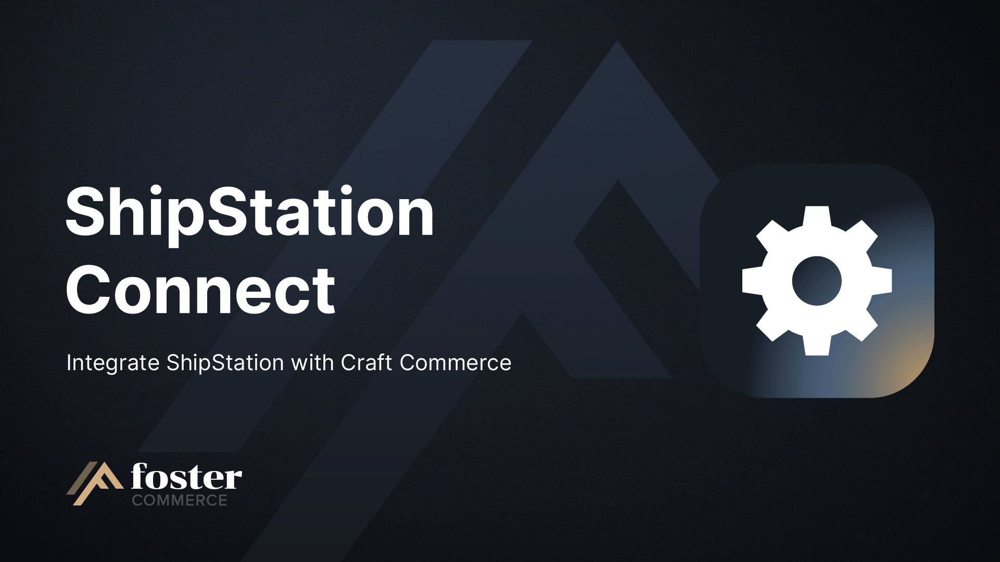
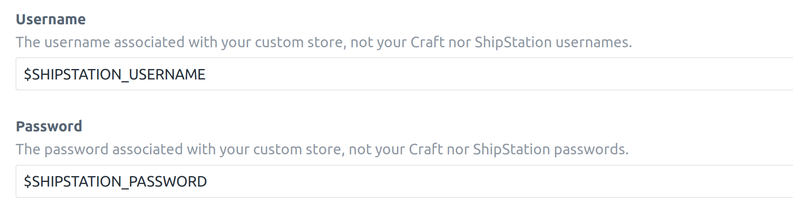
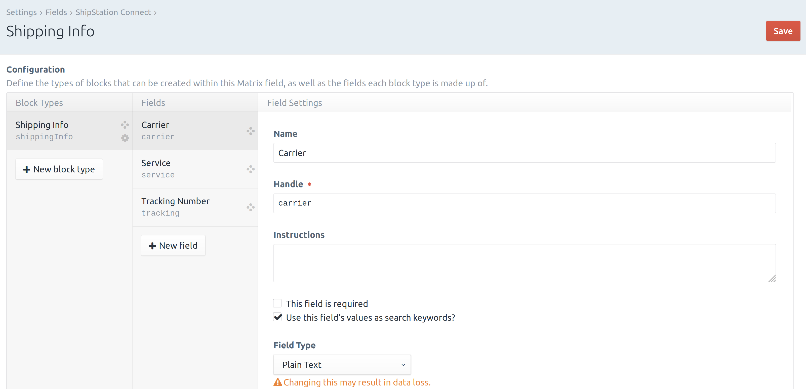
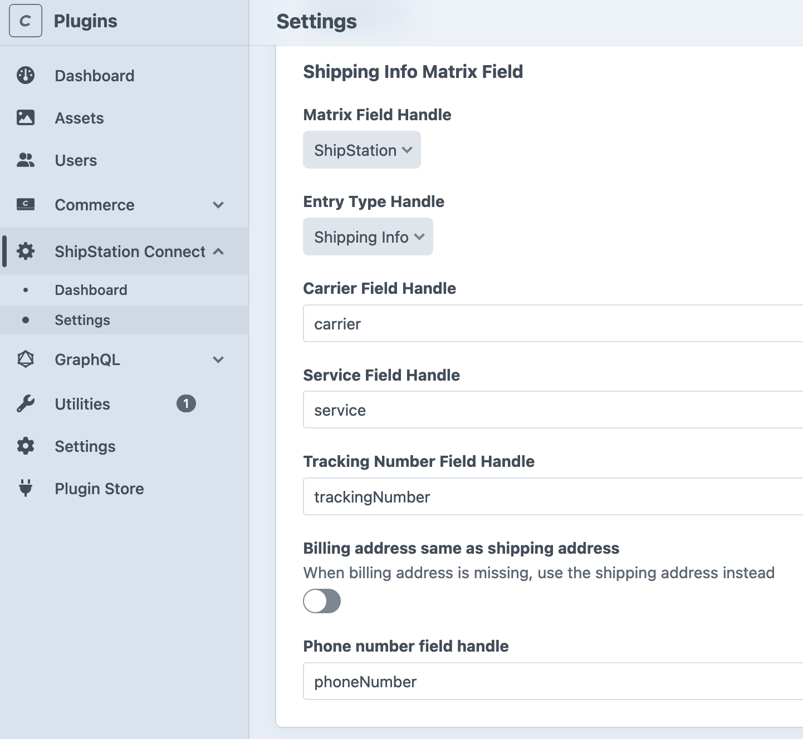

# ShipStation Connect for Craft CMS 4 and Commerce 4

A plugin for Craft Commerce that integrates with a ShipStation Custom Store.

## Requirements

This plugin requires Craft CMS 4 and Commerce 4 or later

## Installation

Install ShipStation Connect from the Plugin Store or with Composer

### From the Plugin Store

Go to the Plugin Store in your project’s Control Panel and search for
“ShipStation Connect.” Click on the “Install” button in its modal window.

### With Composer

Open your terminal (command line) and run the following commands:

```bash
# go to the project directory
cd /path/to/my-project

# tell Composer to load the plugin
composer require fostercommerce/shipstationconnect

# tell Craft to install the plugin
./craft install/plugin shipstationconnect
```

After installing, go to the Craft control panel plugin settings page to
configure the settings for the plugin.

## Custom Store Configuration

Configure your connection in ShipStation following these instructions:
[ShipStation "Custom Store" integration](https://help.shipstation.com/hc/en-us/articles/360025856192-Custom-Store-Development-Guide#UUID-685007d9-4cda-06f2-d2f6-011ab46805af_UUID-001f552d-4260-aeb0-8a23-0f6ff166e045).

### Connect Your Craft Store to ShipStation

The "URL to Custom XML Page" is shown in the ShipStation Connect settings view
in Craft.

### Username/Password

ShipStation allows you to set a custom username and password combination for a
connected store. This combination should match the values stored in the
ShipStation Connnect settings view in your Craft control panel.

**Note:** These are *not* your ShipStation credentials, nor your Craft user
credentials.

As of version 1.2.4, these values can be set with environment variables.


#### Using Craft's Basic Authentication

As of Craft 3.5.0 basic authentication headers can be used to authenticate users
in Craft by setting the
[enableBasicHttpAuth](https://github.com/craftcms/cms/commit/0bb12973635f8cd3cfa11e97b94306dc643c054b)
config setting to `true`.

If basic authentication is enabled for your site,
ShipStation Connect will assume that requests to it have already been
authenticated and continue processing. Using this feature removes the
requirement to set a username/password in the settings and instead it is
recommended to create a dedicated user with the
`shipstationconnect-processOrders` permission for accessing ShipStation Connect.

When `enableBasicHttpAuth` is `false`, the plugin will read the auth header and
validate against the username/password configured in ShipStation Connect's
settings.

#### Debugging Apache Authentication Errors

> The remote server returned an error

If you are seeing a 400 error (401 or 404 notably) and you're running on Apache.
Try adding the following to your apache config.

```
CGIPassAuth On
RewriteRule .* - [E=HTTP_AUTHORIZATION:%{HTTP:Authorization}]
```

### Order Statuses

Ensure your shipping statuses in Craft Commerce and ShipStation match. You edit
each platform to use custom statuses and ShipStation can match multiple Craft
statuses to a single ShipStation status, when needed.

## Commerce Integration

### Matrix Field

ShipStation Connect requires a Matrix Field for storing shipping information.

The matrix field should have a block type with text fields for the following:

- Carrier
- Service
- Tracking Number



In the ShipStation Connnect settings, select the matrix field, and enter the
handles for the block type and text fields.


When a shipping notification is received for an order from ShipStation, the
plugin will add the shipping information to the Shipping Information field on
the order and set the order to the Craft status paired with your ShipStation
stores Shipped status.

## Adding phone numbers to addresses sent to Shipstation

Addresses are now part of Craft rather than Commerce, and the Phone number field was dropped from the address model. It
is now necessary to add a custom field to the Address fields to store phone numbers.

The plugin setting gives you the option to set the field handle that you are using for phone numbers. The contents of
this field will then be sent to Shipstation within the address portions of the order data.

## Custom Fields

You can customize the data that is sent to ShipStation by listening to the `OrderEvent` event in a custom module or
plugin, and set the values that you want per field, similar to the following example:

```php
use craft\base\Event;
use fostercommerce\shipstationconnect\models\Order;
use fostercommerce\shipstationconnect\events\OrderEvent;
use fostercommerce\shipstationconnect\services\Xml;

Event::on(
	Xml::class,
	Xml::ORDER_EVENT,
	static function (OrderEvent $e) {
	  // The transformed order - This is the data that will be sent to ShipStation.
		$order = $e->order;
		
		// The source Commerce Order that was used to create the transformed order.
		$commerceOrder = $order->getParent();

		// Use full order number for OrderNumber
		$order->setOrderNumber($commerceOrder->number);

		// Set a custom field value
		$order->setCustomField1(Currency::formatAsCurrency($commerceOrder->getAdjustmentsTotal(), 'USD'));

		// Set internal notes
		$order->setInternalNotes('Custom Field 1: Adjustments Total');
	}
);
```

`OrderFieldEvent` properties:

- `order` - The order that has been transformed into a format ready to be exported to ShipStation. 

If you've changed the `OrderFieldEvent::FIELD_ORDER_NUMBER` field to be anything
other than the order's reference number, you'll need to listen to the
`OrdersController::FIND_ORDER_EVENT` to use your own query to fetch the order.
In the example above, we're changing it to be the order's ID, so we would need
to fetch the order by ID:

```php
use craft\base\Event;
use craft\commerce\elements\Order as CommerceOrder;
use fostercommerce\shipstationconnect\controllers\OrdersController;
use fostercommerce\shipstationconnect\events\FindOrderEvent;

Event::on(
    OrdersController::class,
    OrdersController::FIND_ORDER_EVENT,
    function (FindOrderEvent $e) {
        // Set the order so that ShipStation Connect can update it's shipping details.
        $this->order = CommerceOrder::find()->number($e->orderNumber)->one();
    }
);
```

`FindOrderEvent` properties:

- `orderNumber` - The order number sent by ShipStation.
- `order` - The order that will be updated with shipping information.
