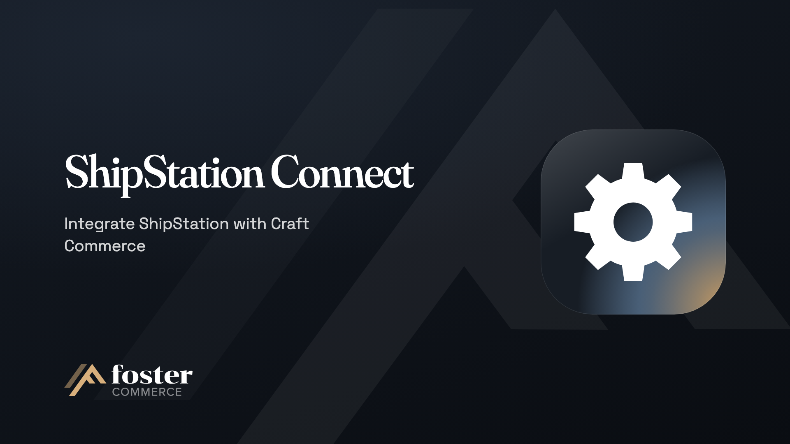

# ShipStation Connect

A plugin for Craft Commerce that integrates with a ShipStation Custom Store.

## Overview

- Sends completed Commerce orders to ShipStation, so shipping is handled there instead of in Craft.
- Marks an order shipped in Craft when it ships from ShipStation, and records the carrier, service, and tracking number on the order.
- Runs on ShipStation's schedule. ShipStation requests orders changed inside a date range, so there is no export step in Craft.
- Sends the whole order: line items with quantities, prices, weights, photos, and options, plus shipping and billing addresses, phone number, and totals.
- Routes orders to separate ShipStation stores from a field on the order (one store per brand, for example).


## Requirements

- Craft CMS `^5.0`
- Craft Commerce `^5.0`
- PHP `^8.2`

## Install

```sh
composer require fostercommerce/shipstationconnect
./craft plugin/install shipstationconnect
```

Then set a username and password under **ShipStation Connect -> Settings**, and create a custom store in ShipStation pointing at the URL that page shows.

See [`docs/installation.md`](./docs/installation.md) for the full guide.

## Order export

ShipStation calls the plugin's URL and gets back the completed orders that changed inside the date range it asks for, oldest first, one page at a time. There is no queue job and no stored export: every request reads Commerce live.

An order that has no line items, no customer, or no shipping address is left out of the response rather than breaking the run.

See [order export](./docs/user-guide/order-export.md).

## Shipping notifications

When ShipStation reports a shipment, it calls the same URL with the carrier, service, and tracking number. The plugin sets the order to your shipped status and writes the three values into a Matrix field on the order, where your templates and emails can read them.

See [shipping notifications](./docs/user-guide/shipping-notifications.md).

## Multiple stores

If you run more than one ShipStation store, point a Dropdown field on the order at the store it belongs to. The settings page then lists one URL per option, and each ShipStation store only ever sees its own orders.

See [multiple ShipStation stores](./docs/user-guide/order-export.md#multiple-shipstation-stores).

## Customizing what is sent

Every order passes through an event before it is serialized, so a site module can overwrite any field, fill the custom fields, or write internal notes. A second event lets you replace the query that finds an order when a shipping notification comes back.

See [customizing exported orders](./docs/dev-guide/customizing-exported-orders.md).

## Documentation

See [`docs/`](./docs/index.md).

## License

Proprietary. See [LICENSE.md](./LICENSE.md).

## Credits

Brought to you by [Foster Commerce](https://fostercommerce.com).
