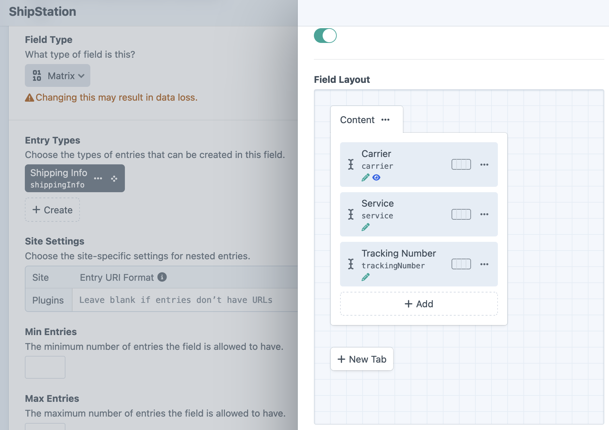
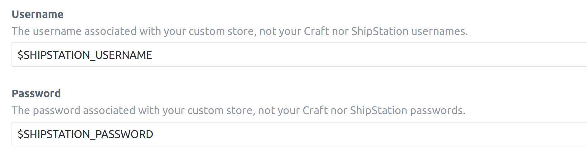
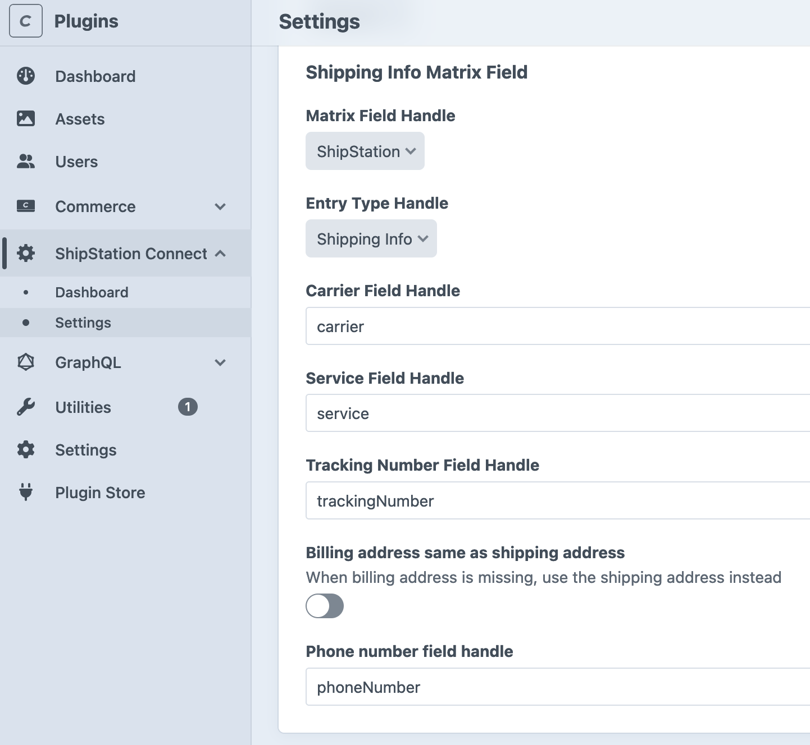

# Installation

Setup, from `composer require` to a connected ShipStation store.

## Requirements

- Craft CMS `^5.0`
- Craft Commerce `^5.0`
- PHP `^8.2`

Commerce must be installed and enabled before this plugin.

## Install

```sh
composer require fostercommerce/shipstationconnect
./craft plugin/install shipstationconnect
```

DDEV:

```sh
ddev composer require fostercommerce/shipstationconnect -w && ddev craft plugin/install shipstationconnect
```

A **ShipStation Connect** item appears in the control panel nav. Its **Dashboard** entry is a shortcut out to ShipStation's own site.

## Create the shipping info field

ShipStation sends back a carrier, a service, and a tracking number per shipment, and they are stored in a Matrix field on the order. Create it before configuring the plugin.

Under **Settings -> Fields -> New field**, add a Matrix field with one entry type holding three Plain Text fields:

| Field           | Handle           |
|-----------------|------------------|
| Carrier         | `carrier`        |
| Service         | `service`        |
| Tracking Number | `trackingNumber` |



Add it to the order field layout under **Commerce -> Settings -> Order Fields**. A field that is not on the layout has nowhere to store a value.

## Configure

**ShipStation Connect -> Settings.** The **Settings -> Plugins -> ShipStation Connect** entry redirects to the same page.

### Custom store

- **Select ShipStation Store field**: a Dropdown field on the order that says which ShipStation store the order belongs to. Default: none, meaning every order goes to one store. See [multiple ShipStation stores](./user-guide/order-export.md#multiple-shipstation-stores).
- **Username**: the username ShipStation authenticates with. Not a Craft user, and not your ShipStation login. No default.
- **Password**: the matching password. No default.

Both credential fields accept an environment variable, which keeps the values out of project config:



### Export

- **Page Size for Orders**: how many orders ShipStation gets per request. Default: `25`. Raise it and each request takes longer but there are fewer of them; lower it if requests are timing out.
- **Order ID Prefix**: prepended to the Commerce order ID in the `OrderID` field. Empty by default. Set it when one ShipStation account takes orders from more than one Craft site, so the IDs stay unique.
- **Fail export on validation failure**: returns an error to ShipStation when any order in the page is invalid, instead of leaving that order out and sending the rest. Off by default. See [why an order is missing](./user-guide/troubleshooting.md#an-order-never-reached-shipstation).
- **Product Images Field Handle**: the Assets field to take each item's photo from, read off the variant and falling back to the product. Default: none, meaning items go out without photos.
- **Billing address same as shipping address**: sends the shipping address as the billing address on orders that have no billing address. Off by default, and with it off an order with no billing address is left out of the export.
- **Phone number field handle**: the custom field on the address element that holds the phone number. Empty by default. Craft addresses have no native phone field, so without this ShipStation gets no phone number. See [phone numbers](./user-guide/order-export.md#phone-numbers).

### Shipping notifications

- **Status Handle**: the order status an order moves to when ShipStation reports it shipped. Default: `shipped`.
- **Matrix Field Handle**: the Matrix field created above. Default: `shippingInfo`.
- **Entry Type Handle**: the entry type inside that field. Default: `shippingInfo`.
- **Carrier Field Handle**, **Service Field Handle**, **Tracking Number Field Handle**: the three fields inside the entry type. Defaults: `carrier`, `service`, `trackingNumber`.



## Connect ShipStation

The settings page shows the URL to give ShipStation:

```
https://your-site.com/actions/shipstationconnect/orders/process
```

In ShipStation, add a store of type **Custom Store** and paste that URL with the username and password. ShipStation's own [custom store guide](https://help.shipstation.com/hc/en-us/articles/360025856192-Custom-Store-Development-Guide) covers the screens on their side.

ShipStation also asks which of your statuses mean awaiting shipment and which mean shipped. Commerce's defaults are `processing` and `shipped`; check yours under **Commerce -> Settings -> Order Statuses**. A ShipStation status takes more than one source status, comma separated, and the values are case sensitive, so they have to match your Commerce handles exactly.

## Check it works

To see the same response ShipStation gets:

```sh
curl -u "$SHIPSTATION_USERNAME:$SHIPSTATION_PASSWORD" \
  "https://your-site.com/actions/shipstationconnect/orders/process?action=export"
```

An `<Orders>` document comes back with an `<Order>` per completed order. `pages="0"` means none matched. See [order export](./user-guide/order-export.md) for which orders qualify.

Then ship one of those orders in ShipStation. The order in Craft moves to your shipped status, its Shipping Info field holds the carrier, service, and tracking number, and its activity log reads "Marking order as shipped. Adding shipping information."

If either direction fails, see [troubleshooting](./user-guide/troubleshooting.md).

## Setting values per environment

Any setting can be set in `config/shipstationconnect.php`, keyed by property name. A value in the file wins over the one saved on the settings page, and the page keeps showing the saved value.

```php
<?php

return [
    'shipstationUsername' => '$SHIPSTATION_USERNAME',
    'shipstationPassword' => '$SHIPSTATION_PASSWORD',
    'ordersPageSize' => 50,
    'productImagesHandle' => 'productImages',
    'phoneNumberFieldHandle' => 'phoneNumber',
];
```

Property names, in the order the settings appear above: `storesFieldHandle`, `shipstationUsername`, `shipstationPassword`, `ordersPageSize`, `orderIdPrefix`, `failOnValidation`, `productImagesHandle`, `billingSameAsShipping`, `phoneNumberFieldHandle`, `shippedStatusHandle`, `matrixFieldHandle`, `entryTypeHandle`, `carrierFieldHandle`, `serviceFieldHandle`, `trackingNumberFieldHandle`.
